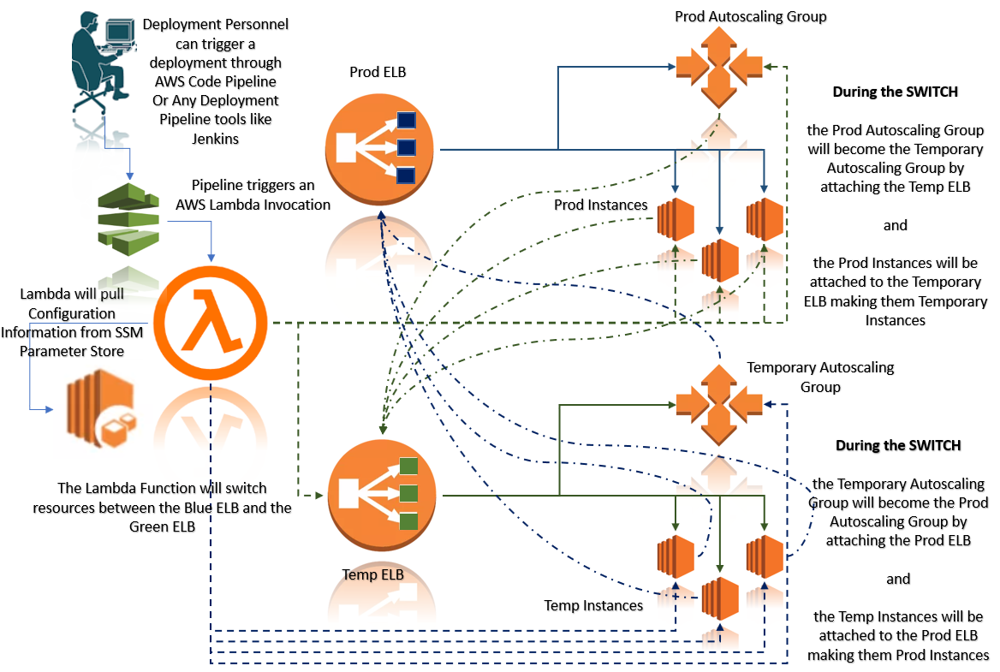

# aws-blue-green-deployment

This is an AWS Lambda Function that will perform a server switch process called Blue Green Deployment. At this point, there is no Approval Process but that process is replaced by a CI/CD Manual Trigger to perform a Blue Green Switch.

## Requirements
- python 3.6
- awscli (install via python pip command - recommended)
- [serverless framework](https://serverless.com/)
- JSON/YAML
- AWS Client Configuration with Correct AWS KEY and AWS SECRET or AWS ASSUME ROLE Configured

### Assumption
This assumes that a Production ELB, ASG and EC2 instances exists. A new ELB, ASG, EC2 instances are created for a switch over using SSM Parameters.

### SSM Parameter

The SSM Parameter was used to hold Elastic Load Balancer Name and Autoscaling Group Name and the current state of the deployment whether it is a Blue or a Green.

### Initialization Script for the Parameter Store

AWS Client was used to push initial default values for the SSM Parameter Keys.

### Typical Flow

